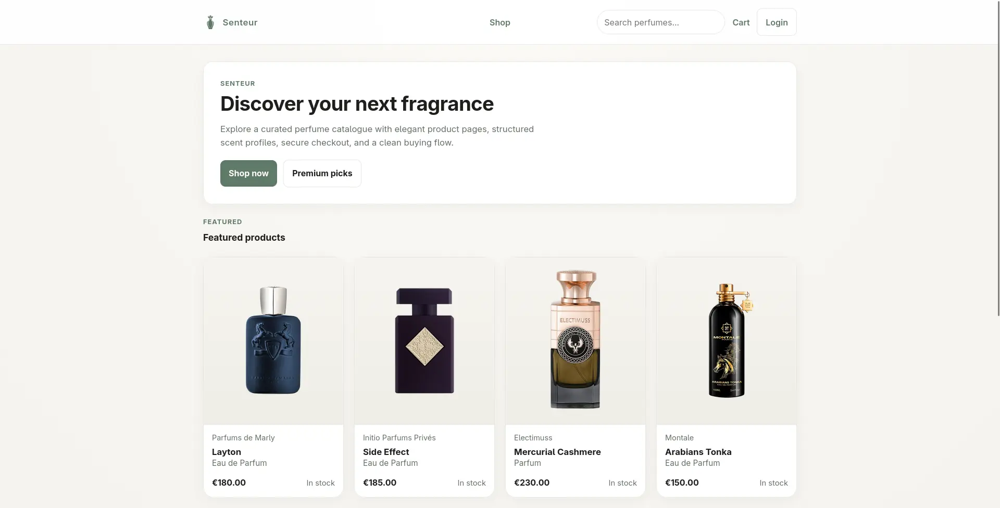
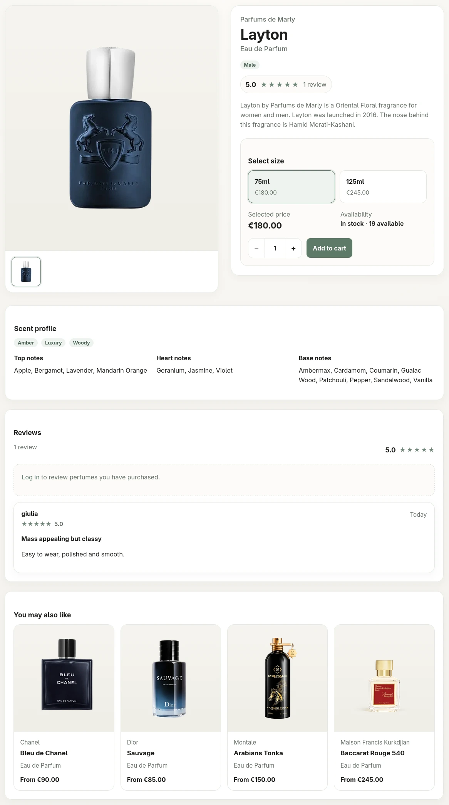
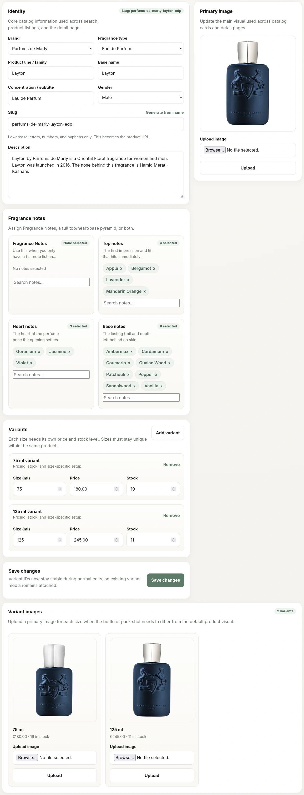

# Senteur

Senteur is a specialized e-commerce engine for boutique fragrance retailers. Built with a custom PHP 8.3 MVC architecture, it provides a high-performance shopping experience paired with a robust administrative suite for managing complex fragrance metadata.


*A specialized storefront for fragrance discovery and seamless checkout.*

## Key Features

### 🛍️ Premium Storefront
- **Olfactory Discovery**: Filter and search the catalog by specific scent notes (Top, Heart, Base).
- **Commerce Flow**: Session-persistent cart, secure customer profiles, and saved address management.
- **Integrated Payments**: Full Stripe Checkout integration with automated webhook handling for order fulfillment.

### 🛠️ Administrative Workspace
- **Catalog Management**: Detailed control over fragrance concentrations, brands, and availability.
- **Fragrance Metadata**: Dedicated tools to manage the library of scent notes and olfactory families.
- **Order Fulfillment**: Real-time order tracking and customer status management.

<details>
<summary><b>📸 View Interface Showcases (Click to expand)</b></summary>

| Product Detail Page | Administrative Workspace |
| :---: | :---: |
|  |  |
| *Gallery, reviews, and scent notes* | *Managing inventory and metadata* |

</details>

## Technical Stack

| Layer              | Technology                                          |
| ---                | ---                                                 |
| **Language**       | PHP 8.3 (Strictly typed)                            |
| **Architecture**   | Custom MVC with Service/Repository layers           |
| **Web Server**     | Nginx                                               |
| **Infrastructure** | PHP-FPM & Docker Compose                            |
| **Tunneling**      | Cloudflare Tunnel (Optional Quick Tunnel support)   |
| **Database**       | MySQL 8.0                                           |
| **Payments**       | Stripe API (`stripe/stripe-php`)                    |

## System Architecture
The application implements a decoupled MVC pattern to separate concerns and improve testability:


- **Request Pipeline**: Nginx → `index.php` → Bootstrapper → Regex Router → Controller.
- **Service Layer**: Controllers remain lean, delegating all domain logic and third-party integrations (like Stripe) to specialized Services.
- **Data Persistence**: Repositories encapsulate PDO queries, ensuring the core remains independent of the database schema.
- **View Layer**: Server-side rendered PHP templates with a shared layout system.

## Project Layout
```
senteur/
├── docker/        # Container configuration (PHP, Nginx, MySQL)
├── docs/          # Architecture diagrams and technical deep-dives
├── public/        # Web root, assets, and runtime uploads
├── src/           # Core Logic: Controllers, Services, Repositories, Views
└── resources/     # Raw demo assets and seeding data
```

## Getting Started

### Prerequisites
- Docker & Docker Compose
- Port `8080` and `3306` available

### Installation
1. **Environment Setup**:
```bash
cp .env.example .env
```
2. **Launch Containers**:
```bash
docker compose up --build
```
3. **Access the App**: Navigate to `http://localhost:8080`

### Demo Credentials
The system is seeded with the following accounts for testing:
- **Admin**: `admin@example.com` / `password123`
- **Customer**: `mario@example.com` / `password123`

## Stripe Integration
To test the payment flow, configure your Stripe keys in `.env`:
```env
STRIPE_SECRET_KEY=sk_test_...
STRIPE_PUBLISHABLE_KEY=pk_test_...
STRIPE_WEBHOOK_SECRET=whsec_...
```
**Webhook Local Forwarding**:
```bash
stripe listen --forward-to localhost:8080/webhooks/stripe
```

## Optional Cloudflare Quick Tunnel
To expose the application securely for testing (e.g., for Stripe Webhooks) without configuring port forwarding:
- Enable the profile in your `.env`: `COMPOSE_PROFILES=cloudflare`
- Start the stack: `docker compose up`
- Retrieve the temporary `trycloudflare.com` URL from the `cloudflared` service logs.

## Documentation
- [Detailed Project Structure](docs/PROJECT_STRUCTURE.md)
- [Architecture & Database Diagrams](docs/diagrams/)
- [Component Documentation](docs/pages/)

## Credits
- [Fragrantica](https://fragrantica.com): Scent profiles and olfactory data.
